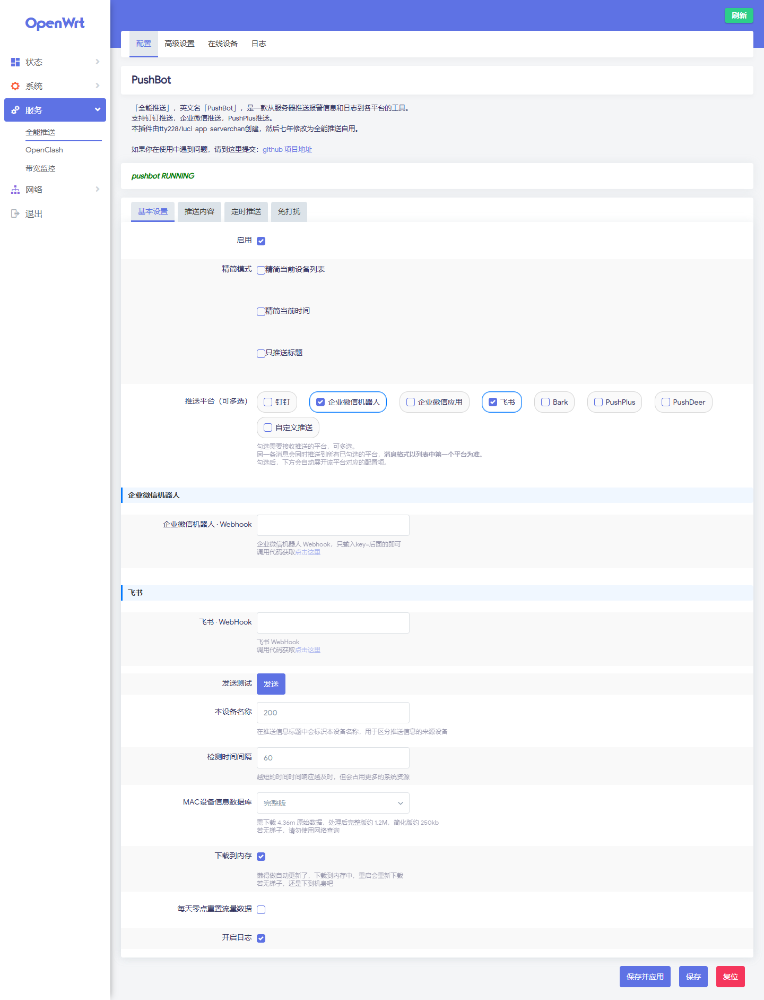
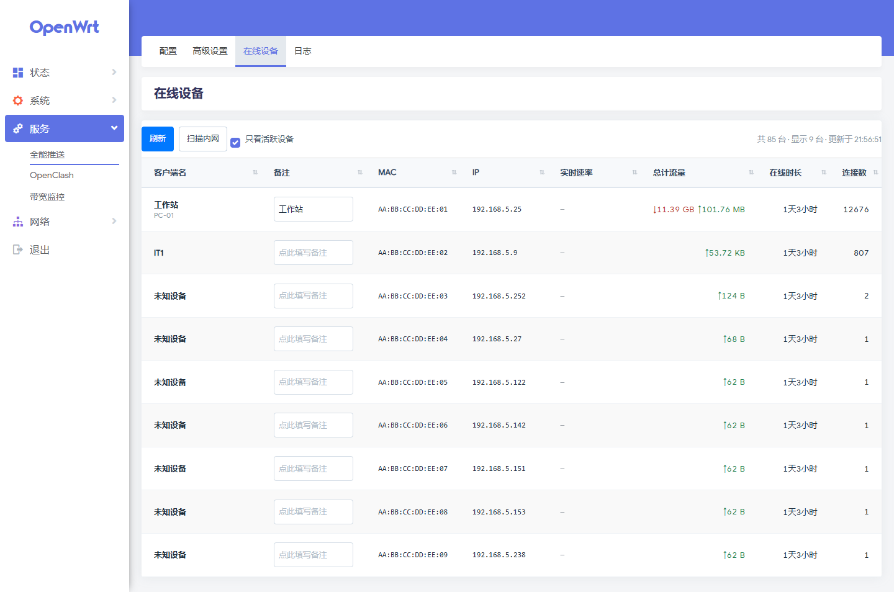
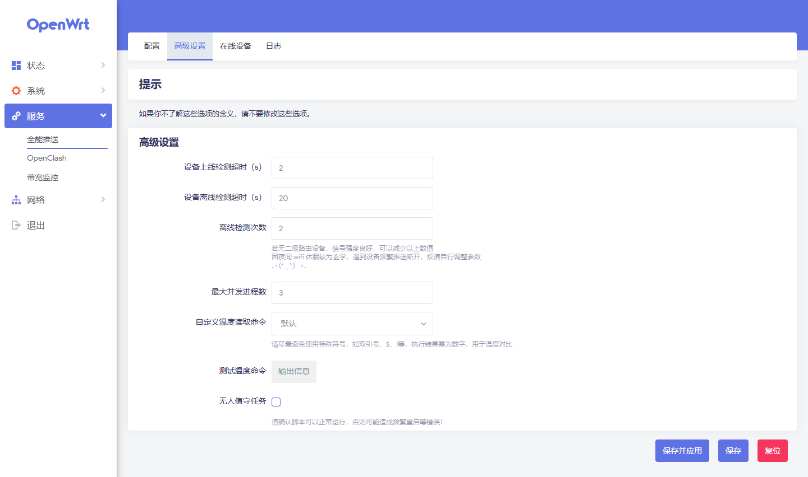

> # ⚠️ 来源声明
>
> **本仓库是派生版本，不是原创项目。**
>
> - 原项目：[zzsj0928/luci-app-pushbot](https://github.com/zzsj0928/luci-app-pushbot)（基于其 **v3.61**）
> - 更早的原创：[tty228/luci-app-serverchan](https://github.com/tty228/luci-app-serverchan)
>
> 本仓库由 [@441060226](https://github.com/441060226) 在上游 v3.61 基础上修改而来，
> **版权归原作者所有，仅供学习交流使用**。
> 上游项目未声明开源许可证，如需商用或二次分发，请先联系原作者。
>
> - 本分支 `custom-v3.61`：**带功能增强的版本**（推荐使用）
> - `main` 分支：上游 v3.61 原版代码，未做修改，便于对照
> - 安装包下载：[**Releases**](https://github.com/441060226/luci-app-pushbot-lua/releases)

---

# 📦 本分支改动（相对上游 v3.61）

### 推送渠道
- 新增**企业微信应用**推送
- 多平台推送重构：每个渠道使用独立临时文件，避免互相覆盖
- 增加 curl 超时保护（连接 5s / 总 15s），单渠道失败不影响其它渠道
- 返回值感知：`errcode` / `code` / `StatusCode` 非 0 视为失败并记录日志

### 设备识别
- 新增 MAC 设备信息数据库，支持**设备备注 / 别名**
- 备注优先级高于自动解析的主机名

### 在线设备页（新增页面）
- 新增**实时速率列**（基于 conntrack 采样差值）
- 备注列可直接编辑（失焦 / 回车保存）
- 30 秒自动刷新，编辑过程中自动暂停渲染
- **点击表头排序**：8 列全部支持，三态循环（降序 → 升序 → 取消），
  按原始数值比较（IP 按数值段排序），排序状态通过 localStorage 持久化
- 深色模式适配

### 推送渠道说明页（新增页面）
- 新增各渠道配置指引页面

### 配置页
- 重设计推送平台与凭据字段布局
- 隐藏「推送模式（旧）」「设备别名」等冗余字段
- 自动刷新提示语支持自定义

### 依赖兼容
- `wrtbwmon` 已被 OpenWrt 25.12 官方源移除
- 增加依赖多源回退：优先 `wrtbwmon`，缺失时自动使用 `nlbwmon`
- 依赖检测改为「两者都无」才告警

### 稳定性修复
- 修复 BusyBox ash 对负数做 `-ge` 比较报 `out of range` 并静默失败的问题
  （改用 awk 计算 delta 并将负值 clamp 到 0）
- 修复日志中内部标识符显示为友好渠道名
- 修复手动发送失效、标题不同步等问题

### 权限
- 扩展 rpcd ACL：新增备注读写、设备列表接口

### 安装包

| 文件 | 适用系统 | 包管理器 |
|---|---|---|
| `luci-app-pushbot_3.61-2_all.ipk` | OpenWrt ≤ 24.10 | opkg |
| `luci-app-pushbot_3.61-2_all.apk` | OpenWrt 25.12+ | apk |

下载地址：[Releases](https://github.com/441060226/luci-app-pushbot-lua/releases)

---

# 改名公告
#### 2021年04月25日 起luci-app-serverchand 改名为 luci-app-pushbot

如需拉取编译
请把：

`# git clone https://github.com/zzsj0928/luci-app-serverchand package/luci-app-serverchand`

改为

`git clone https://github.com/zzsj0928/luci-app-pushbot package/luci-app-pushbot`

并把 .config 中

`CONFIG_PACKAGE_luci-app-serverchand=y`

改为

`CONFIG_PACKAGE_luci-app-pushbot=y`

注意：本次改名需要提前备份serverchand配置，并于PushBot中重新配置。

再次谢谢各位支持

# 申明
- 本插件由[tty228/luci-app-serverchan](https://github.com/tty228/luci-app-serverchan)原创.
- 因微信推送存在诸多弊端（无法分开聊天工具与功能性消息推送，通知内不显示内容，内容需要点开才能查看等）,
- 故由  然后七年  @zzsj0928 重新修改为本插件，为钉钉机器人API使用。
- 本插件工作在：openwrt
- 本插件支持：钉钉推送,企业微信推送,PushPlus推送,微信推送,企业微信应用推送,飞书推送,钉钉机器人推送,企业微信机器人推送,飞书机器人推送,一对多推送,Bark推送(仅iOS),PushDeer,PushDeer自架
- 自20210911之后的版本，支持Bark群组，群组名默认为设备名
- 自20210901之后的版本，增加依赖jq，请重新编译或在安装前同步安装jq

# 界面预览

> 以下为**本分支（custom-v3.61）**的实际界面截图。

### 配置页 · 推送平台与凭据

推送平台改为分组多选，勾选后自动展开对应的配置项。

### 在线设备 · 实时速率与表头排序

新增页面。支持实时速率、备注编辑、点击表头排序（8 列三态循环）。

### 高级设置

超时、重试次数、线程数等参数调节。

# 下载
- 本仓库（含本分支改动）：[441060226/luci-app-pushbot-lua Releases](https://github.com/441060226/luci-app-pushbot-lua/releases)
- 上游原版：[zzsj0928/luci-app-pushbot Releases](https://github.com/zzsj0928/luci-app-pushbot/releases)

-----------------------------------------------------
#####################################################
-----------------------------------------------------

# 以下为原插件简介：

# 简介
- 用于 OpenWRT/LEDE 路由器上进行 Server酱 微信/Telegram 推送的插件
- 基于 serverchan 提供的接口发送信息，Server酱说明：http://sc.ftqq.com/1.version
- **基于斐讯 k3 制作，不同系统不同设备，请自行修改部分代码，无测试条件无法重现的 bug 不考虑修复**
- 依赖 iputils-arping + curl 命令，安装前请 `opkg update`，小内存路由谨慎安装
- 使用主动探测设备连接的方式检测设备在线状态，以避免WiFi休眠机制，主动探测较为耗时，**如遇设备休眠频繁，请自行调整超时设置**
- 流量统计功能依赖 wrtbwmon ，自行选装或编译，该插件与 Routing/NAT 、Flow Offloading 冲突，开启无法获取流量，自行选择，L大版本直接编译 luci-app-wrtbwmon

#### 主要功能
- 路由 ip/ipv6 变动推送
- 设备别名
- 设备上线推送
- 设备离线推送及流量使用情况
- CPU 负载、温度监视
- 定时推送设备运行状态
- MAC 白名单、黑名单、按接口检测设备
- 免打扰
- 无人值守任务

#### 说明
- 潘多拉系统、或不支持 sh 的系统，请将脚本开头 `#!/bin/sh` 改为 `#!/bin/bash`，或手动安装 `sh`
- 追新是没有意义的，没有问题没必要更新，上班事情忙完了，摸鱼又不会摸，只能靠写几行 bug ，才能缓解无聊这样子

#### 已知问题
- 直接关闭接口时，该接口的离线设备会忽略检测
- 部分设备无法读取到设备名，脚本使用 `cat /var/dhcp.leases` 命令读取设备名，如果 dhcp 中不存在设备名，则无法读取设备名（如二级路由设备、静态ip设备），请使用设备名备注

# Download
- [luci-app-serverchan](https://github.com/tty228/luci-app-serverchan/releases)
- [wrtbwmon](https://github.com/brvphoenix/wrtbwmon)
- [luci-app-wrtbwmon](https://github.com/brvphoenix/luci-app-wrtbwmon) 

#### ps
- 新功能看情况开发
- 王者荣耀新赛季，不思进取中
- 欢迎各种代码提交
- 提交bug时请尽量带上设备信息，日志与描述（如执行`/usr/bin/serverchan/serverchan`后的提示、日志信息、/tmp/serverchan/ipAddress 文件信息）
- 三言两句恕我无能为力
- 武汉加油

